# Runs 4 to 8: where to hold an object, and where to put it

Runs 4 to 8 use the same loop as runs 1 to 3: Jev picks the next skill from the
state, the governor checks it, and the arm carries it out (see the README).
From run 4 to run 7 only one thing changes: how the grasp is planned. Run 4 plans
it from a box, run 5 from a mask and depth, and runs 6 and 7 from the object's
geometry, its STL. Run 8 keeps run 7's grasp and uses the geometry of two parts
to put one over the other, with about 2 mm to spare.

The pictures come from each run's recording. The overlays are drawn on the first
frame, before the arm moves. The fingers are drawn where the arm actually closed
them, taken from the joints it reported at that moment. Run 8's look pictures are
the ones the run itself saved at each look. `figures/make_figures.py` draws them
all again.

| Run | Perception | The grasp comes from | Where the fingers closed | Lever to the centre of mass | Carried, released | Outcome |
|---|---|---|---|---|---|---|
| 4 | Grounding DINO | the centre of a box | on the trowel's neck, 48° across it | 6 mm | 32 cm, 21 cm | across the crate's rim |
| 5 | SAM 3 and depth | a line across the mask | across the handle | 55 mm | 32 cm, 21 cm | in the crate, hung blade down on the way |
| 6 | SAM 3 and the STL | the geometry: where it balances | straight across the ferrule | 2 mm | 26 cm, 15 cm | in the crate, carried level |
| 7 | SAM 3 and the STL | the geometry: the pose from the outline | across the hex flats of a chrome fitting | under 1 mm | 16 cm, 7 cm | in the crate |
| 8 | SAM 3 and both parts' STLs | the geometry, 10 mm towards the arm | across the hex flats, leaning 45° | — | 19 cm, 3 cm | down over the spanner to the table; the spanner stood |

The lever is the horizontal distance from the object's centre of mass to the
line between the places the pads touch. Once the object is lifted, gravity turns
it about that line. Run 8 sets its grip by the spanner, not by balance, so its
lever is not given.

## Run 4: a box has only a centre

Grounding DINO answers a phrase with a box. Asked for "handle", it boxed the
whole trowel. The only grasp a box offers is its centre. The fingers close along
the base's y axis, because a box has no direction.

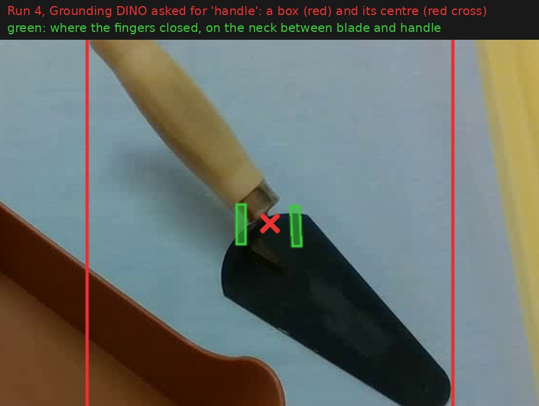

The box's centre fell on the neck between the blade and the handle. That is
close to where this trowel balances, 6 mm from it, but only because of the
tool's shape. On another tool the centre could land anywhere. The fingers
closed 48° across the neck instead of straight across it. At that angle the pads
meet the round ferrule at an edge, which does not stop the tool turning. Once
lifted, the trowel swung blade down anyway.

The box also sets how far the object can reach below the grasp: the distance to
the box's far corner on the table, 19 cm. So the trowel was carried at 32 cm and
let go 21 cm above the table. It fell across the crate's rim, blade inside and
handle outside.

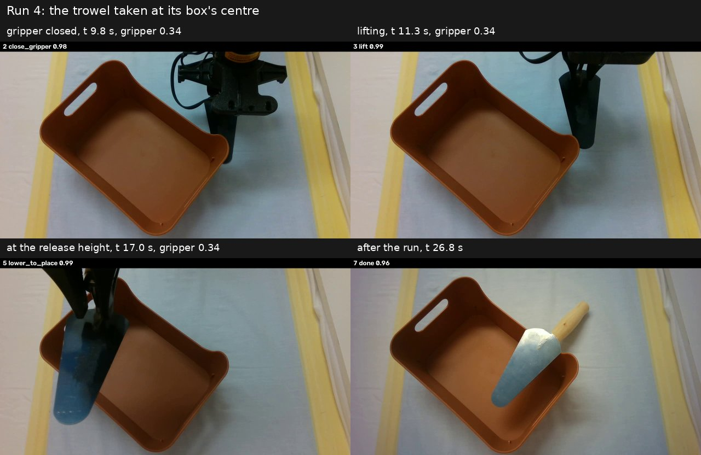

## Run 5: a mask shows where the handle is

SAM 3 answers with a mask of the handle. `skills.grasp_search` combines the mask
with depth to find a line across the part. Only the part's own material may lie
between the fingers, and there must be room beside it for both fingers to come
down. The fingers closed straight across the handle, 51 mm behind the blade's
heel edge.

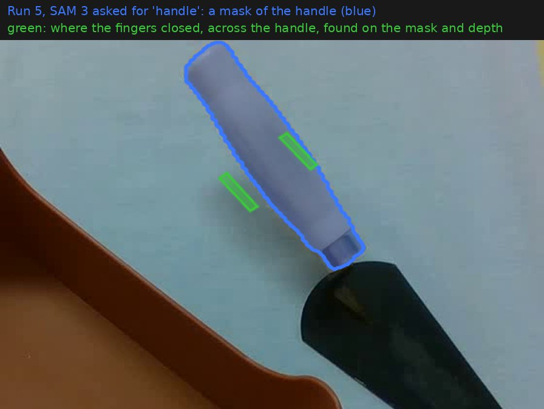

That is the right place for a hand, but not for a parallel gripper that carries
the tool flat. The steel blade outweighs the beech handle, so the centre of mass
is 55 mm from the grip. Lifted, the trowel turns about the grip until its centre
of mass hangs below it, which leaves it hanging blade down.

The run plans for that. Before lifting, it measures how far the whole object
reaches from the grasp point: 19 cm, the blade's tip. It carries the trowel that
far above the crate's rim, at 32 cm, with the gripper leaning to reach that
high. It lowers the trowel until the tip is 2 cm above the crate's floor, and
lets go at 21 cm.

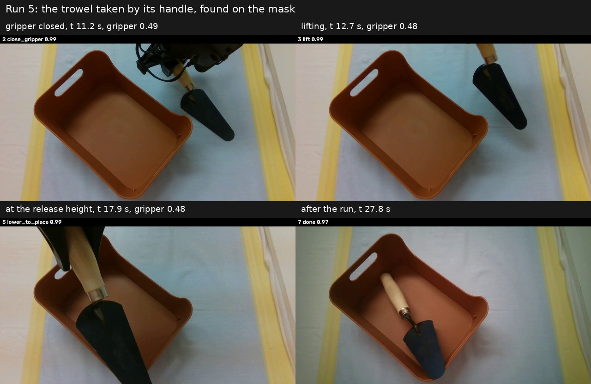

## Run 6: the geometry shows where it balances

With the trowel's STL (`piper_llm/assets/objects/trowel`), the run knows more
than the trowel's outline: it knows where the mass is. Steel is ten times denser
than beech. So the centre of mass sits under the steel ferrule, 42 mm from the
middle of the tool's volume. `meta.json` records it, computed from the steel and
beech parts the STL was built from.

1. **Pose.** SAM 3 masks the whole tool. `piper_llm/geometry.py` renders the
   STL's outline from the camera in each way the trowel can rest on a table. It
   shifts and turns each outline until one covers the mask; the best match is
   0.91.
2. **Grasp.** The search tries every finger direction, every place along the
   trowel and every height. It keeps a grasp only when all of these hold:
   - the pads meet the outermost material squarely, not with an edge or a slope;
   - the two touched places face each other across the part;
   - the open fingers come down beside the trowel, not on it.

   Of those, it takes the grasp whose line between the pads passes closest to
   the centre of mass. Among equally close ones, it prefers pads centred on the
   touched places, then the largest contact.

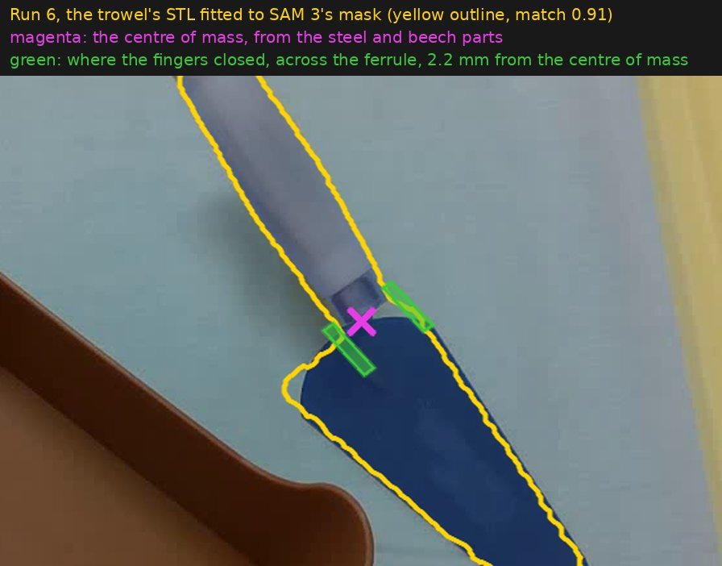

The fingers closed straight across the ferrule, 2 mm from the centre of mass,
with the pads centred on the ferrule's widest line. From the side, the two grips
compare like this:

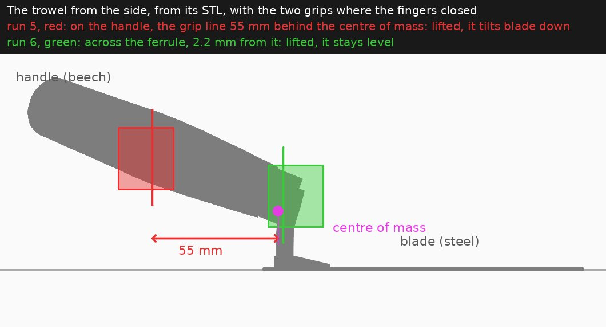

The trowel weighs about 130 g (estimated, not weighed). The torque that tilts it
is its weight times the lever. At run 5's 55 mm, that torque turned the trowel
blade down. At run 6's 2 mm, it is 25 times smaller, the pads hold it, and the
trowel is carried level.

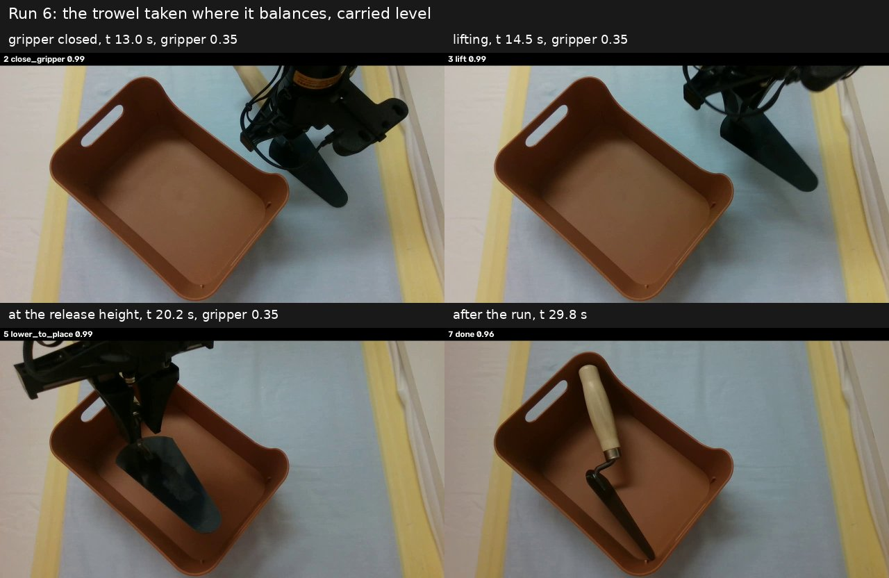

The trowel was let go 15 cm above the table. The carry heights still assume the
object could hang: they use its farthest point from the grasp, 13 cm, as how
deep it might reach below. So the trowel dropped into the crate and landed on
its side.

## Run 7: the geometry grips what the depth camera cannot see

The object is a 1-inch pipe fitting in chrome-plated brass, standing on one end.
Chrome reflects the depth camera's infrared pattern.

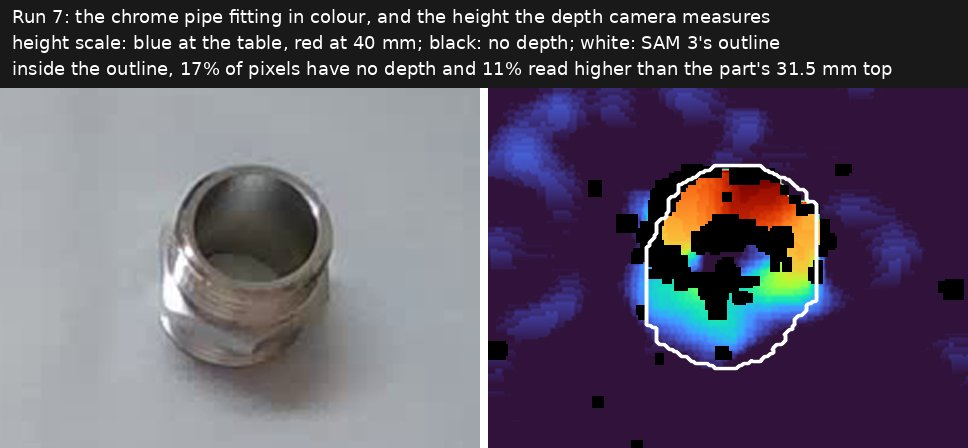

Inside the fitting's outline, 17% of the pixels have no depth, and 11% read
higher than the part can be. The top ring is flat at 31.5 mm, but its measured
height changes by more than 2 cm across it, with gaps where there is no depth at
all. A grasp planned on that depth moves from frame to frame. The red crosses below are the camera-only grasp points from 17 frames
taken before the arm moved, with nothing in the scene changing. They are up to
21 mm apart.

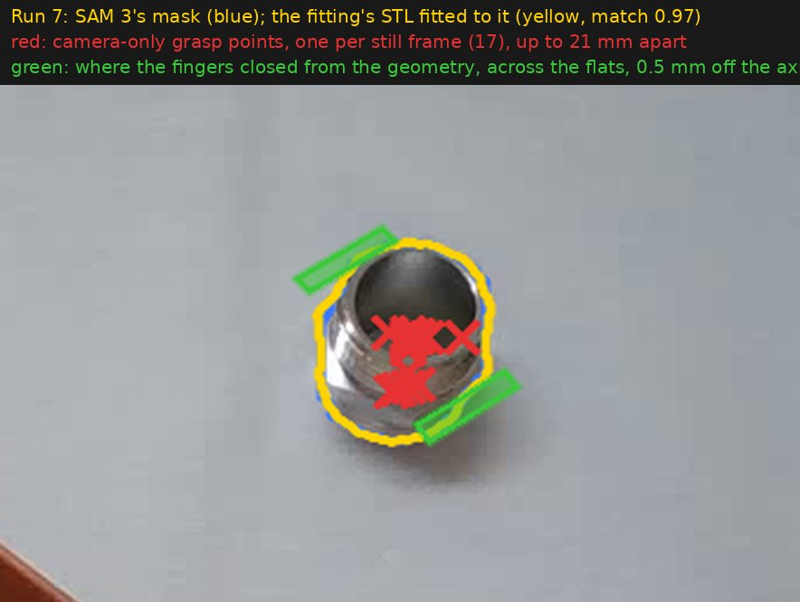

The geometry does not need the depth. SAM 3's outline stays clean even on
chrome, and an object resting on a table has only three unknowns for each way it
can rest: x, y and its turn about the vertical. Fitting the STL's outline to the
mask gives the pose. The grasp search then finds the pair of flat faces across
the hex, 34.7 mm apart. The fingers closed 0.5 mm from the fitting's axis. The
gripper read 0.56, which is the flats plus the gripper's play under load (see
`checks.md`).

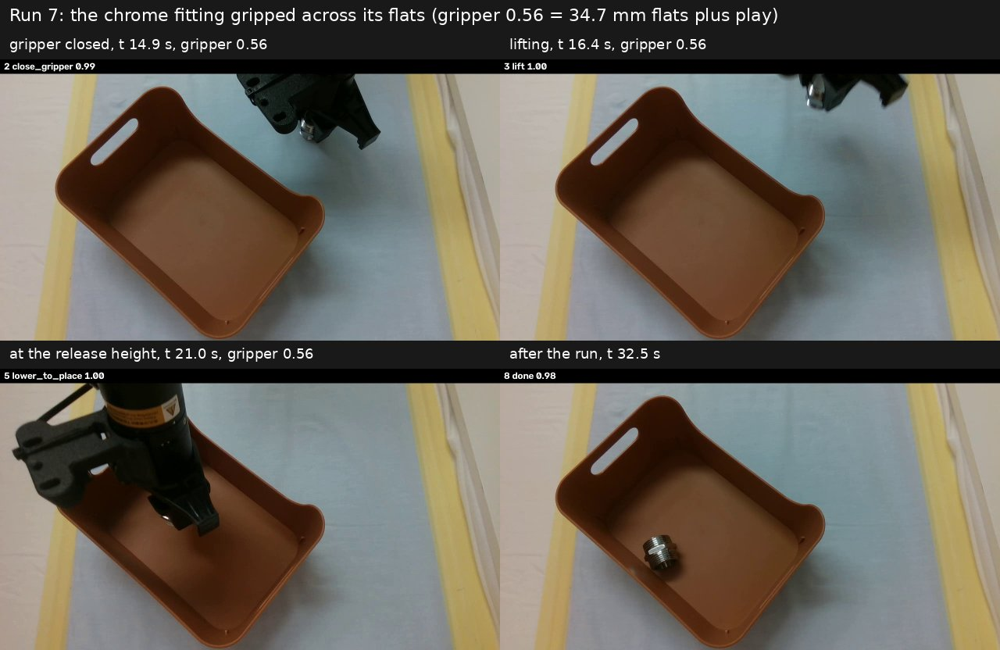

The same fitting was also tried without the geometry, standing and then lying.
Both times the camera-only run delivered it to the crate. The fingers open to
70 mm and push a 35 mm part to the middle as they close. The grip landed off the
flats (the gripper read 0.61), and the grasp point depended on which frame it was
planned from. On this part, the geometry does not decide whether the grip holds.
It decides where the grip lands: on the flats, where it was planned, every time.

## Run 8: the geometry puts one part over another

Run 8 keeps run 7's fitting and changes where it goes: down over a box spanner
standing on end, 141 mm tall. The fitting's bore is 25.5 mm and the spanner's
hex is 21.3 mm across its corners, so there are about 2 mm to spare on each
side. Both parts are chrome, so both are placed by their STLs. SAM 3 is asked
for "metal object", each mask is fitted with both STLs, and the better fit names
the part. The task is `SlideOver` in `piper_llm/task.py`.

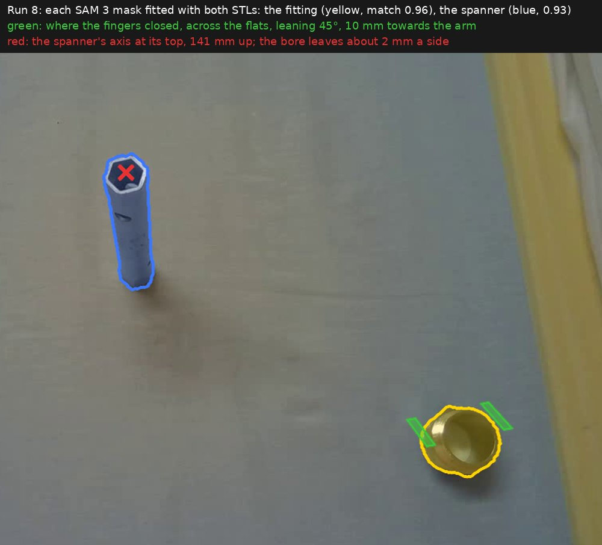

**Leaning.** The fitting has to pass over the spanner's top, 14 cm up, and the
wrist cannot point the gripper straight down that high. So the gripper leans 45°
about the line between its fingers for the whole run. The fingers stay level,
and the fitting held upright between them stays upright. Two things follow from
the lean:

- The arm reaches that far leaning only 50 to 60 cm from its base. So the
  fitting stands there, and this run widens the workspace box from 50 to 58 cm.
- The leaning fingertips reach lower than the tool point. The fingers take the
  fitting with the tool point 23 mm up, which keeps their lowest corner 3.8 mm
  above the table.

Before the arm moves, the task checks every waypoint for reach with the lean
held, and the fingers' height above the table. The gripper holds the fitting
10 mm towards the arm, at the fingers' outer end. That leaves more room between
the gripper and the spanner's top, so the fitting can go further down.

Jev picks each step from ten skills: approach, descend, close, lift, move over
the spanner, align, slide down, let go, retreat and done. The careful motion is
inside the skills.

**Lining up.** Near the spanner's top, the camera's calibration is good to a few
millimetres, which is more than the gap. So the arm stops with the fitting 8 mm
above the top, and the camera measures where the held fitting really is. SAM 3
masks it, and the STL's outline is fitted to the mask, with the fingers and the
spanner left out of the fit. The spanner's axis comes from the same camera, so
most of the calibration error cancels. The arm moves by the difference, then
looks again.

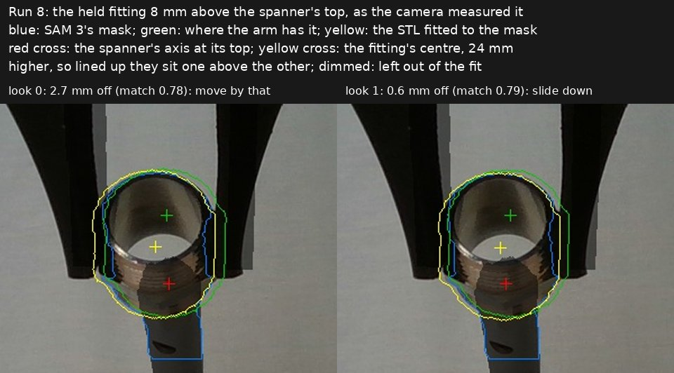

The first look found the fitting 2.7 mm off the spanner's axis and the second
0.6 mm, within the 0.8 mm the task asks for. The governor lets Jev slide down
only once the fitting is lined up.

**Sliding down.** The fitting goes down at 5 mm/s. Two checks can stop it:

- the depth camera watches the space just above the spanner's top, and stops the
  slide if anything comes within 10 mm of it;
- the slide also stops if the arm falls 3 mm behind its path.

Neither fired. The fitting went down to the floor set for it: its bottom 11 mm
above the table, 130 mm down the spanner. The governor lets Jev let go only once
the fitting is at least 20 mm onto the spanner. Let go, it dropped the last
11 mm to the table, around the spanner's base.

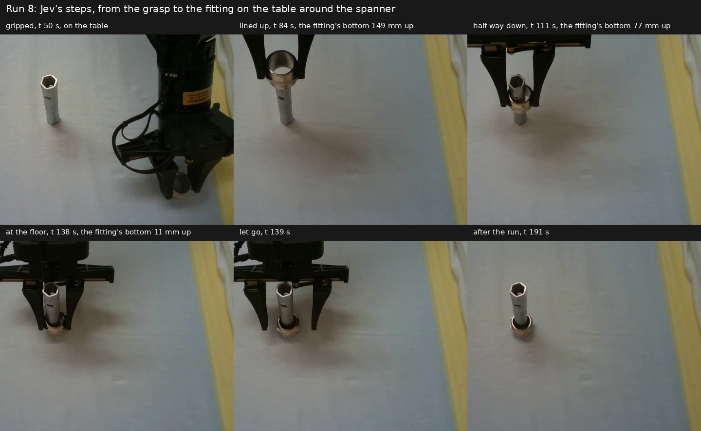

**The spanner still moves a little.** The spanner stood, but it did not stay
exactly where it was. With a clear view after the run, its top is 2.8 mm from
where it stood before. During the slide the fingers hide part of the top. The
frames clear enough to measure show it moving about 2 mm as the fitting's bottom
passed 60 mm. The depth watch cannot see this: it only looks for something
coming down onto the top. The likely cause is the arm drifting a millimetre or
two over the 130 mm descent after lining up once at the top, so that the bore
rubs the spanner. A second look partway down would catch that.

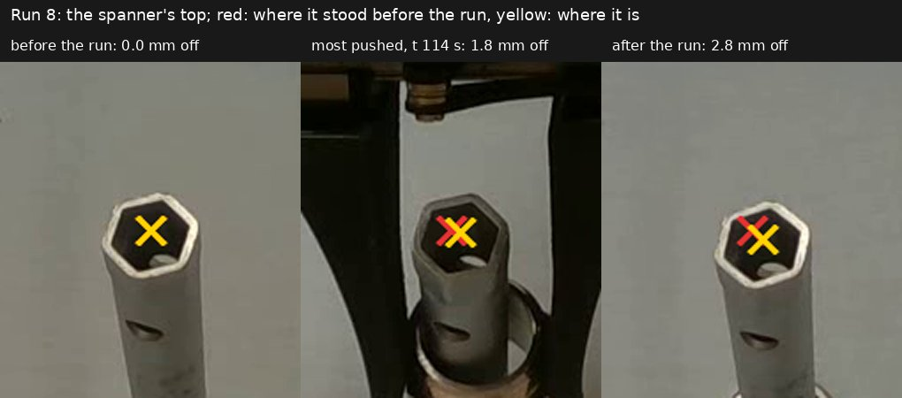

## Making the figures again

The recordings themselves are not included in the repository. The script is
here so the figures can be redrawn from your own recordings, which
`piper_llm/record.py` writes to `out/recordings`. From the repository root:

```bash
python docs/figures/make_figures.py      # every run's figures
python docs/figures/make_figures.py 8    # only run 8's
```

The recording folders are named at the top of the script. For each run, the
script reads the first frame, the joints when the gripper closed, the decisions
and the gripper readings. For run 8 it also reads the look pictures the run
saved, and follows the spanner's top through the video. It runs the same
perception and geometry as the run did, and nothing in it moves the arm.
